# 🧜‍♀️ mermaid-mcp-server

A simple and robust MCP server providing live information about Mermaid.js diagrams.

This is a TypeScript-based [Model Context Protocol (MCP)](https://github.com/microsoft/vscode-languageserver-node/blob/main/protocol/src/common/protocol.mcp.ts) server that provides access to Mermaid diagram information. It exposes a set of tools to discover and retrieve details about the various diagram types supported by Mermaid.

## 🚀 How It Works

A client can connect to this server and use the provided tools to query information. For example, a client might first list all available diagrams and then request specific details or examples for one of them.

Here is a mindmap summarizing the server's purpose, tools, and a typical interaction flow:

```mermaid
mindmap
  root((🧜‍♀️ mermaid-mcp-server))
    ::icon(fa fa-server)
    Core Purpose
      ::icon(fa fa-bullseye)
      Provide Mermaid.js Info
      Uses Model Context Protocol (MCP)
    Available Tools
      ::icon(fa fa-toolbox)
      about
      list_diagrams
      get_diagram
      get_diagram_examples
    Client Interaction Flow
      ::icon(fa fa-cogs)
      1. Connect to Server
      2. Query with Tools
        Discover diagrams <br/> (list_diagrams)
        Fetch details <br/> (get_diagram)
        Get examples <br/> (get_diagram_examples)
    Technology
      ::icon(fa fa-code)
      TypeScript
      Node.js
```



## 🛠️ Tools

The server exposes the following tools via MCP:

| Tool Name              | Description                                                          | Parameters                                                              |
| ---------------------- | -------------------------------------------------------------------- | ----------------------------------------------------------------------- |
| `about`                | Provides a general description of the Mermaid project.               | _None_                                                                  |
| `list_diagrams`        | Lists all available Mermaid diagram types.                           | _None_                                                                  |
| `get_diagram`          | Gets detailed information about a specific diagram type.             | `diagramType: string` <br/> (e.g., "flowchart", "sequenceDiagram")      |
| `get_diagram_examples` | Gets one or more syntax examples for a specific diagram type.        | `diagramType: string` <br/> (e.g., "flowchart", "sequenceDiagram")      |

## 💻 Development

To get started with development, follow these steps:

1.  **Clone the repository:**
    ```bash
    git clone <your-repository-url>
    cd mermaid-mcp-server
    ```

2.  **Install dependencies:**
    ```bash
    npm install
    ```

3.  **Run the server in development mode:**
    ```bash
    npm run dev
    ```

4.  **Build for production:**
    ```bash
    npm run build
    ```
